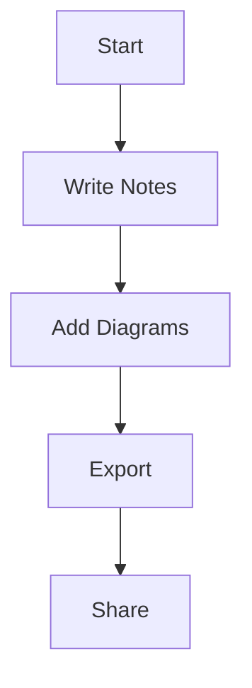

# note 1770998228778

# Atlas Workspace

**A modern, offline-first markdown/pdf workspace for developers**

Atlas Workspace is a local-first note-taking application built with electron, React and Typescript.

Goal was to work offline, and maintain full control of your data

## Feautures

### Rich Markdown Editing

-   \*\* **Bold** \*\*, _\* italic \*, ~~ strikethrough ~~, and \`_ `inline code` \`
    
-   Headings (H1, H2, H3)
    
-   Lists (ordered and unordered)
    
-   Code blocks with syntax highlighting
    
-   Blockquotes
    
-   Horizontal rules
    

### Mermaid Diagrams

Create flowcharts,sequence diagrams, and more directly in your notes:


### File Organization

- Notes are stored as `.md` files in your selected workspace folder
- Auto-save every 2 seconds
- Changes persist to disk immediately
- Compatible with any markdown editor

---


### Local-First Architecture

-   **No cloud required** - all data stays on your machine
    
-   **No auth** - just open a folder and start writing
    
-   **No subscription** - completely free forever
    
-   **Git-friendly** - plain markdown files you can version control
    

### Dev Focused

-   designed for technical documentation
    
-   code block support
    
-   mermaid diagram integration
    
-   dark mode by default
    
-   keyboard shortcuts
    

### Export options

-   Export to Markdown(.md)
    

-   Export to PDF with preserved formatting
    
-   Diagrams render properly

### Tech Stack

**Frontend:**
- React 18
- TypeScript
- Tailwind CSS
- Tiptap (rich text editor)
- shadcn/ui (components)

**Backend:**
- Electron 28
- Node.js filesystem APIs
- IPC for renderer-main communication

**Libraries:**
- Mermaid.js (diagrams)
- jsPDF (PDF export)
- Turndown (markdown conversion)
- Lowlight (syntax highlighting)

### Project Structure (not the exact but basic)
```
atlas-workspace-local/
├── electron/          # Electron main process
│   ├── main.js       # Window management & IPC
│   └── preload.js    # IPC bridge
├── src/              # React renderer process
│   ├── components/   # UI components
│   ├── contexts/     # React context
│   ├── hooks/        # Custom hooks
│   └── lib/          # Utilities
├── dist/             # Built files
└── package.json      # Dependencies
```

---
##  Privacy & Security

- **Zero telemetry** - no analytics, no tracking
- **Local storage** - all data stays on your machine
- **No network requests** - works completely offline
- **Open source** - audit the code yourself

---

##  Contributing

Contributions are welcome! This is an open-source project.

**To contribute:**
1. Fork the repository
2. Create a feature branch
3. Make your changes
4. Submit a pull request

**Areas we need help:**
- UI/UX improvements
- Bug fixes
- Documentation
- Testing
- Feature implementations
- Performance

---

## Acknowledgments

Built with these amazing open-source projects:
- [Electron](https://www.electronjs.org/)
- [React](https://react.dev/)
- [Tiptap](https://tiptap.dev/)
- [Mermaid](https://mermaid.js.org/)
- [shadcn/ui](https://ui.shadcn.com/)
- [Tailwind CSS](https://tailwindcss.com/)

---


## License (MIT)
MIT © 2026 **Cem Batuhan Yaman**
